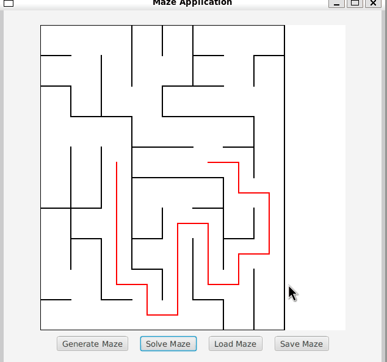

# Project PerfectMaze

В данном командном  проекте реализоавана генерация идеального лабиринта, в котором можно найти маршрут от начальной до конечной точки.

В рамках проекта необходимо было ознакомиться с основными алгоритмами его обработки, такими как: генерация, отрисовка, поиск решения.

Лабиринт хранится в файле в виде количества строк и столбцов, а также двух матриц, содержащих положение вертикальных и горизонтальных стен соответственно.

В первой матрице отображается наличие стены справа от каждой ячейки, а во второй — снизу.

```
4 4
0 0 0 1
1 0 1 1
0 1 0 1
0 0 0 1

1 0 1 0
0 0 1 0
1 1 0 1
1 1 1 1
```

## Как собрать

1. Установить Makefile.
2. Запустить команду `make run`.

## Структура проекта

- Слой `domain` включает в себя бизнес-логику проекта;
- Слой `view` отвечает за отрисовку и взаимодействие с лабиринтом.

Лабиринт генерируется согласно алгоритму Эллера:
https://habr.com/ru/articles/746916/

## Генерация лабиринта и поиск маршрута на базе GUI-библиотеки JavaFX

<details>
  <summary>Показать/скрыть</summary>

  

</details>

## Сохранение и загрузка лабиринта

<details>
  <summary>Показать/скрыть</summary>

  

</details>
